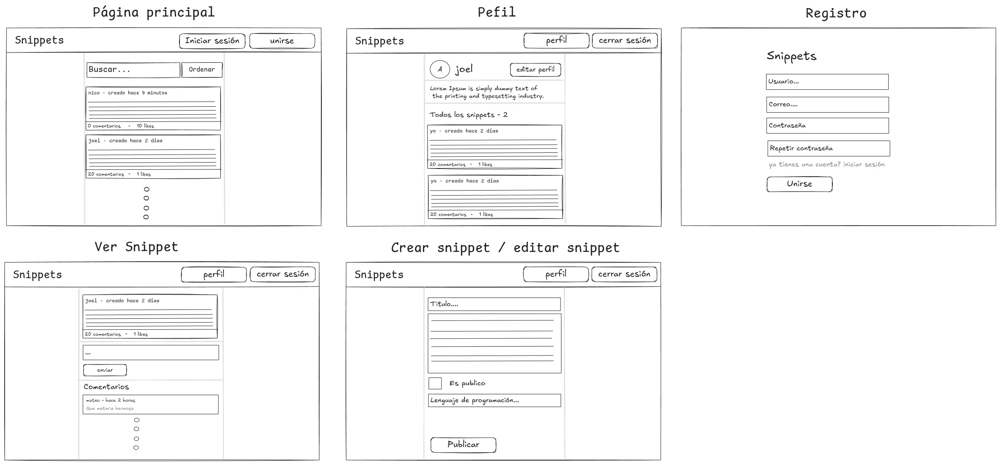
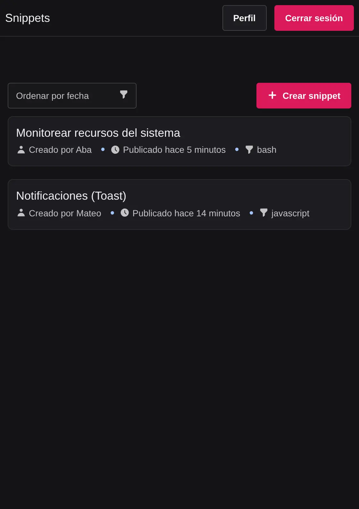
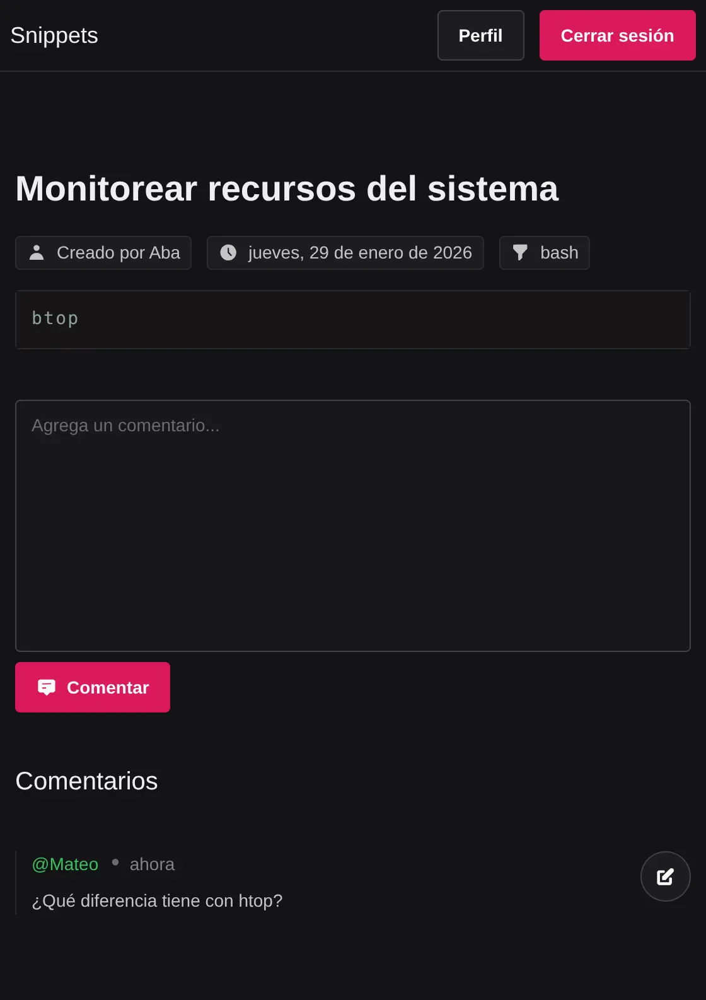
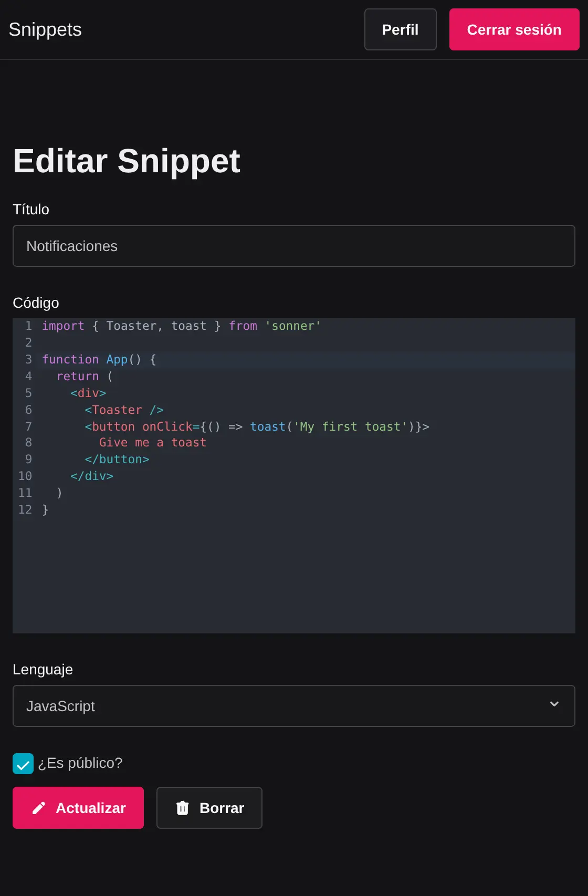
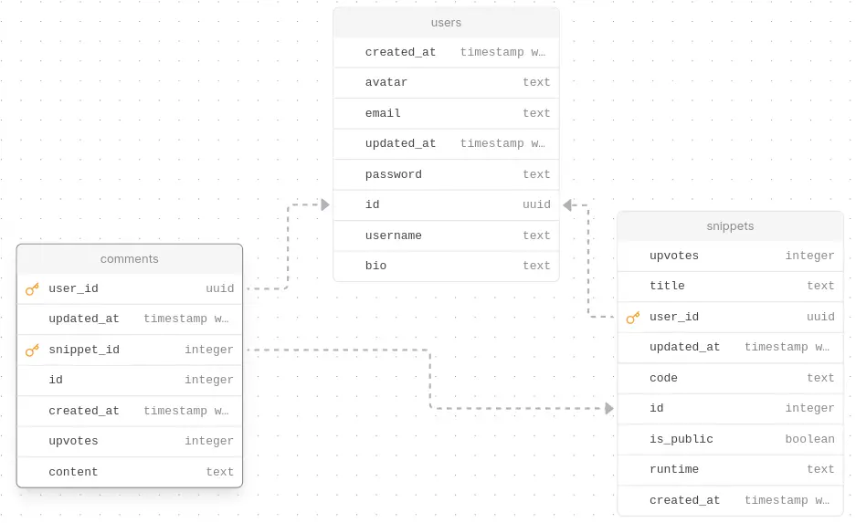

# Snippets

Una plataforma para compartir snippets de código.

**¿Qué es un snippet?**

Un snippet (fragmento en español) es un pequeño trozo de código reutilizable que resuelve un problema específico o realiza una tarea concreta, por ejemplo, una función para formatear fechas.

**Funcionalidades**

- Snippets públicos y privados
- Soporte para todos los lenguajes de programación vistos en la materia
- Autocompletado en el editor
- Filtros básicos

## Demo

El boceto inicial de la aplicación. El desarrollo final difirió en algunos aspectos, pero se mantuvo la idea original.



**Página de inicio**

Todos los snippets públicos se muestran aquí y pueden ordenarse según su fecha de creación.



**Visualizar snippet**

Página para ver un snippet y sus comentarios. Los snippets privados solo son accesibles por su autor.



**Editar snippet**

Página para editar o eliminar un snippet. Solo accesible por el autor.



## Diagrama de la base de datos



## Uso

> [!WARNING]
> Esta guía asume que tienes git y docker instalados en tu sistema.

1. Clonar el repositorio

```sh
git clone git@github.com:mjgonzalez0/tb022-tp-final.git --depth 1
cd tb022-tp-final
```

2. Configurar los servicios

Copia el archivo de ejemplo y edita las variables de entorno:

```sh
cp .env.example .env
```

| `Variable`          | `Descripción`                        | `Valor por defecto` |
| ------------------- | ------------------------------------ | ------------------- |
| `API_PORT`          | Puerto del servidor                  | 5000                |
| `API_AUTH_SECRET`   | Secreto para firmar tokens de acceso | -                   |
| `DATABASE_PASSWORD` | Contraseña de la base de datos       | password            |
| `DATABASE_USER`     | Usuario de la base de datos          | user                |
| `DATABASE_NAME`     | Nombre de la base de datos           | snippets            |
| `DATABASE_HOST`     | Host de la base de datos             | -                   |

> [!WARNING]
> No modifiques el puerto del servidor API (`API_PORT`). La aplicación web está configurada para conectarse al puerto 5000.

3. Ejecutar los servicios

```sh
docker compose up
```

4. Abrir la plataforma accediendo a `http://localhost:3000`
