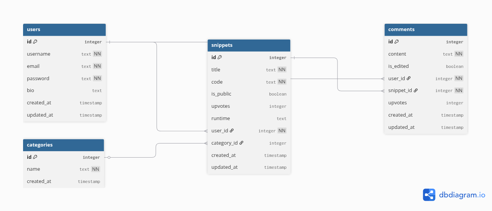

## Usuarios

- `bio`: la biografía del perfil del usuario.

**Relaciones**

- Un usuario puede tener muchos snippets
- Un usuario puede tener muchos comentarios

## Snippets

- `code`: almacena el código del usuario.
- `is_public`: determina si el snippet es visible para todos los usuarios.
- `runtime`: determina en que lenguaje de programación está escrito el código.
- `upvotes`: cantidad de likes que tuvo el snippet.

**Relaciones**

- Un snippet pertenece a un usuario
- Un snippet pertenece a una categoría
- Un snippet puede tener muchos comentarios

## Categorías

**Relaciones**

- Una categoría puede tener muchos snippets

## Comentarios

- `is_edit`: determina si el comentario fue modificado desde su publicación.
- `upvotes`: cantidad de likes que tuvo el comentario.

**Relaciones**

- Un comentario pertenece a un usuario
- Un comentario pertenece a un snippet

## Campos genéricos

- `created_at`: es la fecha en la que se insertó a la base de datos la información.
- `updated_at`: es la fecha en la que se modificó por última vez la fila específica.
